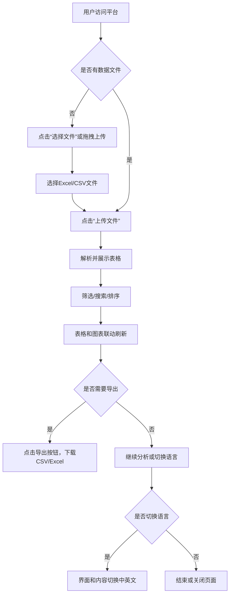

# Excel数据可视化平台 需求文档

## 一、产品简介

本平台是一个基于网页的 Excel 数据上传、分析与可视化工具，支持中英文切换，适用于多种数据展示和分析场景。用户无需安装任何软件，即可通过浏览器上传 Excel 文件，进行数据筛选、排序、统计和可视化展示。

---

## 二、目标用户

1. **数据分析师/业务分析师**  
   快速查看、筛选、分析 Excel 数据，用图表直观展示数据趋势和分布。

2. **企业管理者/决策者**  
   通过可视化报表辅助决策，无需安装复杂软件，直接在网页端查看数据。

3. **教师/学生**  
   用于课堂数据演示、作业数据分析，要求简单易用、支持多语言。

4. **普通办公人员**  
   日常处理、展示、分享 Excel 数据，操作简单、界面友好。

5. **海外用户/多语言环境用户**  
   需要英文界面或中英文切换，平台能自动适应本地语言。

---

## 三、详细功能描述

### 1. 文件上传
- 支持拖拽或点击按钮上传 Excel（.xlsx/.xls）或 CSV 文件。
- 上传区显示当前选择的文件名，未选择时显示“未选择文件”/“No file chosen”。
- 上传按钮支持中英文切换。
- 上传文件类型校验，错误时弹出友好提示。

### 2. 数据表格展示
- 表格自动展示上传的 Excel/CSV 数据，首行为表头。
- 支持分页浏览，每页可自定义显示行数。
- 支持表头点击排序（升序/降序切换）。
- 支持多条件筛选（下拉选择列和值）。
- 支持模糊搜索（输入关键词，表格自动过滤）。
- 表头和内容支持中英文切换（示例数据自动翻译）。

### 3. 数据统计
- 显示总行数、总列数、筛选后行数。
- 统计区支持中英文切换。

### 4. 数据导出
- 支持将当前表格导出为 CSV 或 Excel 文件。
- 导出按钮支持中英文切换。

### 5. 数据可视化
- 支持柱状图（Top 5 产品销量）、饼图（产品类别分布）。
- 图表标题、标签、图例支持中英文切换。
- 图表数据与表格筛选、搜索联动。

### 6. 国际化与本地化
- 支持中英文界面切换，所有静态和动态内容均可切换。
- 默认英文，切换按钮为“中文”，可自动检测浏览器语言（可选）。
- 记忆用户上次选择的语言（可选）。

### 7. 响应式与美观
- 页面自适应不同屏幕尺寸，适配PC、平板、手机。
- 主要控件、按钮、表格、图表布局美观，交互流畅。

### 8. 错误与提示
- 所有操作（如上传、解析、筛选、导出）均有友好提示。
- 错误信息支持中英文切换。

### 9. 页脚信息
- 显示平台名称和年份，支持中英文切换，年份自动更新。

---

## 四、界面原型（结构化文字版）

```
┌──────────────────────────────────────────────┐
│ 顶部导航栏                                   │
│ ┌────────────┬────────────┬────────────┬────┐│
│ │ 品牌LOGO/标题 │ 导出CSV按钮 │ 导出Excel按钮 │ 打印 │ 语言切换 │
│ └────────────┴────────────┴────────────┴────┘│
├──────────────────────────────────────────────┤
│ 主体区域                                     │
│ ┌─────────────┬────────────────────────────┐│
│ │ 左侧面板    │ 右侧数据区                  │
│ │ ┌─────────┐ │ ┌────────────────────────┐ │
│ │ │ 上传区  │ │ │ 数据表格卡片           │ │
│ │ └─────────┘ │ │ ┌───────────────┐      │ │
│ │ ┌─────────┐ │ │ │ 表头          │      │ │
│ │ │ 筛选区  │ │ │ ├───────────────┤      │ │
│ │ └─────────┘ │ │ │ 表格内容      │      │ │
│ │ ┌─────────┐ │ │ └───────────────┘      │ │
│ │ │ 统计区  │ │ │ 分页控件                │ │
│ │ └─────────┘ │ └────────────────────────┘ │
│ │             │ ┌────────────────────────┐ │
│ │             │ │ 数据可视化卡片         │ │
│ │             │ │ ┌─────┬─────┐         │ │
│ │             │ │ │ 柱状图│ 饼图│         │ │
│ │             │ │ └─────┴─────┘         │ │
│ │             │ └────────────────────────┘ │
│ └─────────────┴────────────────────────────┘│
├──────────────────────────────────────────────┤
│ 页脚：平台名称 + 年份                        │
└──────────────────────────────────────────────┘
```

---

## 五、用户流程图



---

## 六、非功能性需求

- **性能**：支持大文件上传与展示，表格渲染流畅。
- **安全**：前端校验文件类型，防止恶意文件上传。
- **兼容性**：兼容主流浏览器（Chrome、Edge、Firefox、Safari）。
- **可维护性**：代码结构清晰，易于扩展和维护。
- **可访问性**：支持键盘操作、屏幕阅读器等无障碍需求。

---

## 七、优化与扩展建议

- 响应式与移动端适配
- 主题切换（深色/浅色模式）
- 表格点击表头排序、列宽拖拽
- 文件上传进度条、拖拽上传
- 数据导出为 PDF、图片等格式
- 代码模块化、自动化测试、自动部署
- 新手引导、FAQ、帮助文档
- 表格虚拟滚动、大数据量优化
- 浏览器语言自动切换、用户偏好记忆

---

## 八、未来可扩展方向

- 支持更多文件格式（如 TSV、JSON）。
- 增加更多图表类型（折线图、雷达图等）。
- 支持多用户协作、数据分享。
- 支持云端存储与同步。 